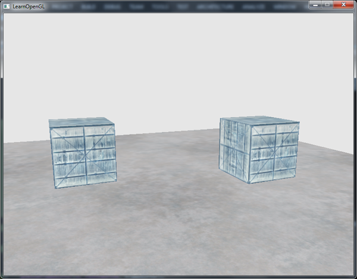
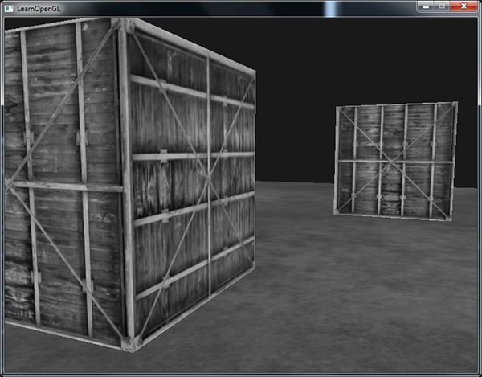
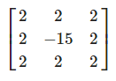
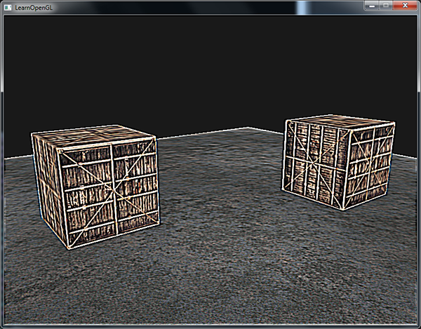
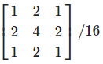
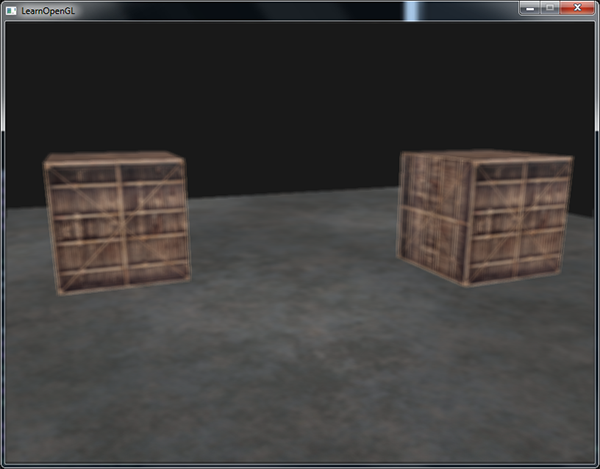
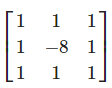
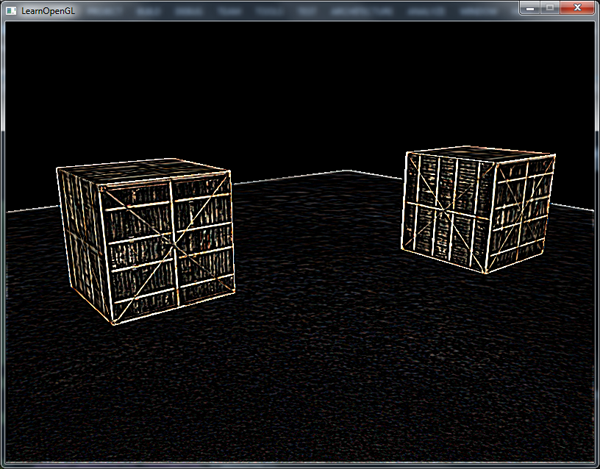
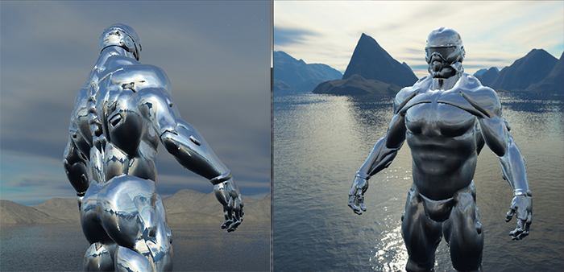
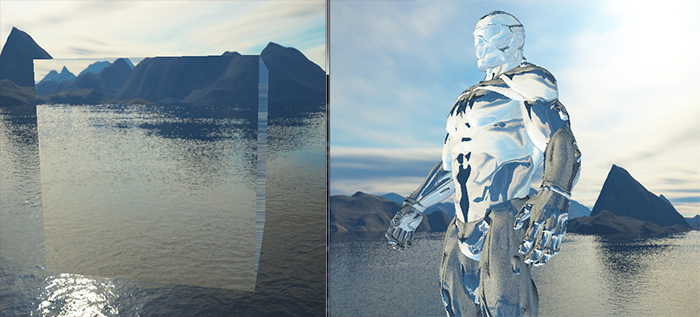

# 4. 高级 OpenGL

[TOC]

## 4.1 深度测试

深度缓冲就像颜色缓冲(Color Buffer)（储存所有的片段颜色：视觉输出）一样，在每个片段中储存了信息，并且（通常）和颜色缓冲有着一样的宽度和高度。深度缓冲是由窗口系统自动创建的，它会以16、24或32位float的形式储存它的深度值。在大部分的系统中，深度缓冲的精度都是24位的。

当深度测试(Depth Testing)被启用的时候，OpenGL会将一个片段的的深度值与深度缓冲的内容进行对比。OpenGL会执行一个深度测试，如果这个测试通过了的话，深度缓冲将会更新为新的深度值。如果深度测试失败了，片段将会被丢弃。

深度缓冲是在片段着色器运行之后（以及模板测试(`Stencil Testing`)运行之后）在屏幕空间中运行的。屏幕空间坐标与通过OpenGL的`glViewport`所定义的视口密切相关，并且可以直接使用GLSL内建变量`gl_FragCoord`从片段着色器中直接访问。`gl_FragCoord`的x和y分量代表了片段的屏幕空间坐标（其中(0, 0)位于左下角）。`gl_FragCoord`中也包含了一个z分量，它包含了片段真正的深度值。z值就是需要与深度缓冲内容所对比的那个值。

### 4.1.1 深度测试函数

调用glDepthFunc函数来设置比较运算符（或者说深度函数(Depth Function)）

| 函数        | 描述                                         |
| ----------- | -------------------------------------------- |
| GL_ALWAYS   | 永远通过深度测试                             |
| GL_NEVER    | 永远不通过深度测试                           |
| GL_LESS     | 在片段深度值小于缓冲的深度值时通过测试       |
| GL_EQUAL    | 在片段深度值等于缓冲区的深度值时通过测试     |
| GL_LEQUAL   | 在片段深度值小于等于缓冲区的深度值时通过测试 |
| GL_GREATER  | 在片段深度值大于缓冲区的深度值时通过测试     |
| GL_NOTEQUAL | 在片段深度值不等于缓冲区的深度值时通过测试   |
| GL_GEQUAL   | 在片段深度值大于等于缓冲区的深度值时通过测试 |

### 4.1.2 深度值精度

**线性深度缓冲**
$$
F_{depth}=\frac{z-near}{far-near}
$$


**非线性深度缓冲**
$$
F_{depth}=\frac{1/z-1/near}{1/far-1/near}
$$


OpenGL默认为非线性缓冲

## 4.2 模板测试


模板缓冲操作允许我们在渲染片段时将模板缓冲设定为一个特定的值。通过在渲染时修改模板缓冲的内容，我们**写入**了模板缓冲。在同一个（或者接下来的）渲染迭代中，我们可以**读取**这些值，来决定丢弃还是保留某个片段。使用模板缓冲的时候你可以尽情发挥，但大体的步骤如下：

- 启用模板缓冲的写入。
- 渲染物体，更新模板缓冲的内容。
- 禁用模板缓冲的写入。
- 渲染（其它）物体，这次根据模板缓冲的内容丢弃特定的片段。

和深度测试的`glDepthMask`函数一样，模板缓冲也有一个类似的函数。`glStencilMask`允许我们设置一个位掩码(Bitmask)，它会与将要写入缓冲的模板值进行与(AND)运算。默认情况下设置的位掩码所有位都为1，不影响输出，但如果我们将它设置为`0x00`，写入缓冲的所有模板值最后都会变成0.这与深度测试中的`glDepthMask(GL_FALSE)`是等价的。

### 4.2.1 模板函数

一共有两个函数能够用来配置模板测试：`glStencilFunc`和`glStencilOp`。

`glStencilFunc(GLenum func, GLint ref, GLuint mask)`一共包含三个参数：

- `func`：设置模板测试函数(Stencil Test Function)。这个测试函数将会应用到已储存的模板值上和`glStencilFunc`函数的`ref`值上。可用的选项有：`GL_NEVER`、`GL_LESS`、`GL_LEQUAL`、`GL_GREATER`、`GL_GEQUAL`、`GL_EQUAL`、`GL_NOTEQUAL`和`GL_ALWAYS`。它们的语义和深度缓冲的函数类似。
- `ref`：设置了模板测试的参考值(Reference Value)。模板缓冲的内容将会与这个值进行比较。
- `mask`：设置一个掩码，它将会与参考值和储存的模板值在测试比较它们之前进行与(AND)运算。初始情况下所有位都为1。

`glStencilOp(GLenum sfail, GLenum dpfail, GLenum dppass)`一共包含三个选项，我们能够设定每个选项应该采取的行为：

- `sfail`：模板测试失败时采取的行为。
- `dpfail`：模板测试通过，但深度测试失败时采取的行为。
- `dppass`：模板测试和深度测试都通过时采取的行为。

每个选项都可以选用以下的其中一种行为：

| 行为         | 描述                                                         |
| ------------ | ------------------------------------------------------------ |
| GL_KEEP      | 保持当前储存的模板值                                         |
| GL_ZERO      | 将模板值设置为0                                              |
| GL_REPLACE   | 将模板值设置为glStencilFunc函数设置的`ref`值                 |
| GL_INCR      | 如果模板值小于最大值则将模板值加1**（多个面片会重复此操作，导致增加多次）** |
| GL_INCR_WRAP | 与GL_INCR一样，但如果模板值超过了最大值则归零                |
| GL_DECR      | 如果模板值大于最小值则将模板值减1                            |
| GL_DECR_WRAP | 与GL_DECR一样，但如果模板值小于0则将其设置为最大值           |
| GL_INVERT    | 按位翻转当前的模板缓冲值                                     |

默认情况下`glStencilOp`是设置为`(GL_KEEP, GL_KEEP, GL_KEEP)`的，所以不论任何测试的结果是如何，模板缓冲都会保留它的值。


### 4.2.2 轮廓绘制

1. 在绘制（需要添加轮廓的）物体之前，将模板函数设置为GL_ALWAYS，每当物体的片段被渲染时，将模板缓冲更新为1。
2. 渲染物体。
3. 禁用模板写入以及深度测试。
4. 将每个物体缩放一点点。
5. 使用一个不同的片段着色器，输出一个单独的（边框）颜色。
6. 再次绘制物体，但只在它们片段的模板值不等于1时才绘制。
7. 再次启用模板写入和深度测试。


>为了达到即使正方体被遮挡也能看见边框的目的
>
>考虑初始模板值为`0xFF`，渲染正方体时填上模板值`0x01`
>
>渲染边框时，取消深度测试，模板测试为不等于`0x01`，填充值为`0`
>
>渲染其他物体时，模板测试为不等于`0`

## 4.3 Blend

### 4.3.1 丢弃

fragment shader 里边使用 `discard` 可以丢弃片段


### 4.3.2 混合

$$
C_{result}=C_{source}∗F_{source}+C_{destination}∗F_{destination}
$$

- `C_source`：源颜色向量。这是源自纹理的颜色向量。
- `C_destination`：目标颜色向量。这是当前储存在颜色缓冲中的颜色向量。
- `F_source`：源因子值。指定了alpha值对源颜色的影响。
- `F_destination`：目标因子值。指定了alpha值对目标颜色的影响。

`glBlendFunc(GLenum sfactor, GLenum dfactor)`函数接受两个参数，来设置源和目标因子。OpenGL为我们定义了很多个选项，我们将在下面列出大部分最常用的选项。注意常数颜色向量`C_constant`可以通过`glBlendColor`函数来另外设置。


### 4.3.3 绘制顺序

1. 先绘制所有不透明的物体。
2. 对所有透明的物体排序。
3. 按顺序绘制所有透明的物体。

## 4.4 裁剪面

### 4.4.1 环绕顺序


### 4.4.2 面剔除

OpenGL的面剔除选项默认是禁用状态的。

```c++
glEnable(GL_CULL_FACE);
```

`glCullFace`函数有三个可用的选项：

- `GL_BACK`：只剔除背向面。
- `GL_FRONT`：只剔除正向面。
- `GL_FRONT_AND_BACK`：剔除正向面和背向面。

glFrontFace函数有两个可用的选项

- `CL_CCW`：逆时针
- `CL_CW`：顺时针

## 4.5 Frame Buffer

一个完整的帧缓冲需要满足以下的条件：

- 附加至少一个缓冲（颜色、深度或模板缓冲）。
- 至少有一个颜色附件(Attachment)。
- 所有的附件都必须是完整的（保留了内存）。
- 每个缓冲都应该有相同的样本数。

### 4.5.1 后期处理

**反相**

```c
FragColor = vec4(vec3(1.0 - texture(screenTexture, TexCoords)), 1.0);
```



**灰度**

```c
FragColor = texture(screenTexture, TexCoords);
float average = 0.2126 * FragColor.r + 0.7152 * FragColor.g + 0.0722 * FragColor.b;
FragColor = vec4(average, average, average, 1.0);
```



**锐化**





**模糊**





**边缘检测**





## 4.6 立方体贴图


### 4.6.1 天空盒


- 深度值变为 `1.0`: `gl_Position = pos.xyww;`
- 最后渲染
- 深度测试函数改为**小于等于**

### 4.6.2 环境映射

通过**视线的反射/折射方向**来采样**环境立方体贴图**来达到简单的反射/折射效果

**反射**


```c
vec3 I = normalize(Position - cameraPos);
vec3 R = reflect(I, normalize(Normal));
```



**折射**


| 材质 | 折射率 |
| ---- | ------ |
| 空气 | 1.00   |
| 水   | 1.33   |
| 冰   | 1.309  |
| 玻璃 | 1.52   |
| 钻石 | 2.42   |

```c
float ratio = 1.00 / 1.52;
vec3 I = normalize(Position - cameraPos);
vec3 R = refract(I, normalize(Normal), ratio);
```



### 4.6.3 动态环境贴图

> 在我们使用的都是静态图像的组合来作为天空盒，看起来很不错，但它没有在场景中包括可移动的物体。我们一直都没有注意到这一点，因为我们只使用了一个物体。如果我们有一个镜子一样的物体，周围还有多个物体，镜子中可见的只有天空盒，看起来就像它是场景中唯一一个物体一样。
>
> 通过使用帧缓冲，我们能够为物体的6个不同角度创建出场景的纹理，并在每个渲染迭代中将它们储存到一个立方体贴图中。之后我们就可以使用这个（动态生成的）立方体贴图来创建出更真实的，包含其它物体的，反射和折射表面了。这就叫做动态环境映射(Dynamic Environment Mapping)，因为我们动态创建了物体周围的立方体贴图，并将其用作环境贴图。
>
> 虽然它看起来很棒，但它有一个很大的缺点：我们需要为使用环境贴图的物体渲染场景6次，这是对程序是非常大的性能开销。现代的程序通常会尽可能使用天空盒，并在可能的时候使用预编译的立方体贴图，只要它们能产生一点动态环境贴图的效果。虽然动态环境贴图是一个很棒的技术，但是要想在不降低性能的情况下让它工作还是需要非常多的技巧的。

## 4.7 高级数据

OpenGL中的缓冲只是一个管理特定内存块的对象，没有其它更多的功能了。在我们将它绑定到一个缓冲目标(Buffer Target)时，我们才赋予了其意义。当我们绑定一个缓冲到`GL_ARRAY_BUFFER`时，它就是一个顶点数组缓冲，但我们也可以很容易地将其绑定到`GL_ELEMENT_ARRAY_BUFFER`。OpenGL内部会为每个目标储存一个缓冲，并且会根据目标的不同，以不同的方式处理缓冲。

到目前为止，我们一直是调用`glBufferData`函数来填充缓冲对象所管理的内存，这个函数会分配一块内存，并将数据添加到这块内存中。如果我们将它的`data`参数设置为`NULL`，那么这个函数将只会分配内存，但不进行填充。这在我们需要**预留**(Reserve)特定大小的内存，之后回到这个缓冲一点一点填充的时候会很有用。

可以使用`glBufferSubData`，填充缓冲的特定区域。要注意的是，缓冲需要有足够的已分配内存，所以对一个缓冲调用`glBufferSubData`之前必须要先调用`glBufferData`。

### 4.7.1 分批顶点数据

- 交错：123123123...123
- 分批：111...1222...2333...3

### 4.7.2 复制缓冲

`glCopyBufferSubData`能够让我们相对容易地从一个缓冲中复制数据到另一个缓冲中。

```c
void glCopyBufferSubData(GLenum readtarget, GLenum writetarget, GLintptr readoffset,
                         GLintptr writeoffset, GLsizeiptr size);
```

如果我们想读写数据的两个不同缓冲都为顶点数组缓冲该怎么办呢？我们不能同时将两个缓冲绑定到同一个缓冲目标上。正是出于这个原因，OpenGL提供给我们另外两个缓冲目标，叫做`GL_COPY_READ_BUFFER`和`GL_COPY_WRITE_BUFFER`。

## 4.8 高级 GLSL

### 4.8.1 GLSL的内建变量

- gl_PointSize
- gl_VertexID

### 4.8.2 片段着色器变量

- gl_FragCoord
- gl_FrontFacing
- gl_FragDepth

### 4.8.3 接口块

```c
in/out BlockName {
    declaration;
    ...
} InstanceName;
```

只要两个接口块的块名一样，它们对应的输入和输出将会匹配起来，实例名(Instance Name)可以是随意的。

### 4.8.4 Uniform缓冲对象

**Uniform块**

```c
layout (std140) uniform UniformBlockName {
	declaration;
    ...
};
```

**std140 布局**

| 类型                | 布局规则                                                     |
| ------------------- | ------------------------------------------------------------ |
| 标量，比如int和bool | 每个标量的基准对齐量为N。                                    |
| 向量                | 2N或者4N。这意味着vec3的基准对齐量为4N。                     |
| 标量或向量的数组    | 每个元素的基准对齐量与vec4的相同。                           |
| 矩阵                | 储存为列向量的数组，每个向量的基准对齐量与vec4的相同。       |
| 结构体              | 等于所有元素根据规则计算后的大小，但会填充到vec4大小的倍数。 |

```c
// std140 布局示例
layout (std140) uniform ExampleBlock
{
                     // 基准对齐量       // 对齐偏移量
    float value;     // 4               // 0 
    vec3 vector;     // 16              // 16  (必须是16的倍数，所以 4->16)
    mat4 matrix;     // 16              // 32  (列 0)
                     // 16              // 48  (列 1)
                     // 16              // 64  (列 2)
                     // 16              // 80  (列 3)
    float values[3]; // 16              // 96  (values[0])
                     // 16              // 112 (values[1])
                     // 16              // 128 (values[2])
    bool boolean;    // 4               // 144
    int integer;     // 4               // 148
}; 
```

**Uniform 缓冲**


## 4.9 几何着色器

**例子**

```c
#version 330 core
layout (points) in;
layout (line_strip, max_vertices = 2) out;

void main() {    
    gl_Position = gl_in[0].gl_Position + vec4(-0.1, 0.0, 0.0, 0.0); 
    EmitVertex();

    gl_Position = gl_in[0].gl_Position + vec4( 0.1, 0.0, 0.0, 0.0);
    EmitVertex();

    EndPrimitive();
}
```

**输入布局修饰符**

- `points`：绘制GL_POINTS图元时（1）。
- `lines`：绘制GL_LINES或GL_LINE_STRIP时（2）
- `lines_adjacency`：GL_LINES_ADJACENCY或GL_LINE_STRIP_ADJACENCY（4）
- `triangles`：GL_TRIANGLES、GL_TRIANGLE_STRIP或GL_TRIANGLE_FAN（3）
- `triangles_adjacency`：GL_TRIANGLES_ADJACENCY或GL_TRIANGLE_STRIP_ADJACENCY（6）

**输出布局修饰符**

- `points`
- `line_strip`
- `triangle_strip`

## 4.10 实例化

实例化相关数据也是 `VertexAttribute`，只需附加一句即可

```c++
glVertexAttribDivisor(VertexAttributeID/*0,1,2...*/, 1);
```

其中，第二个参数代表更新数据所需实例数，0代表每顶点更新，1就是每实例更新，2就是每2个实例更新，以此类推。

`gl_InstanceID`：指示当前实例的序号

## 4.11 抗锯齿

`MSAA`: Multisample Anti-aliasing