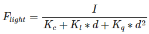
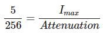
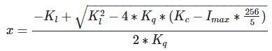

# 5. 高级光照

[TOC]

## 5.1 Blinn-Phong

冯氏光照不仅对真实光照有很好的近似，而且性能也很高。但是它的镜面反射会在一些情况下出现问题，特别是物体反光度很低时，会导致大片（粗糙的）高光区域。下面这张图展示了当反光度为1.0时地板会出现的效果：


原因是视线与反射光线的夹角超过90°


Blinn-Phong模型与冯氏模型非常相似，但是它对镜面光模型的处理上有一些不同，让我们能够解决之前提到的问题。Blinn-Phong模型不再依赖于反射向量，而是采用了所谓的半程向量(Halfway Vector)，即光线与视线夹角一半方向上的一个单位向量。当半程向量与法线向量越接近时，镜面光分量就越大。


效果如下


## 5.2 Gamma校正

过去，大多数监视器是阴极射线管显示器（CRT）。这些监视器有一个物理特性就是两倍的输入电压产生的不是两倍的亮度。输入电压产生约为输入电压的2.2次幂的亮度，这叫做监视器Gamma。

Gamma也叫灰度系数，每种显示设备都有自己的Gamma值，都不相同，有一个公式：设备输出亮度 = 电压的Gamma次幂，任何设备Gamma基本上都不会等于1，等于1是一种理想的线性状态，这种理想状态是：如果电压和亮度都是在0到1的区间，那么多少电压就等于多少亮度。对于CRT，Gamma通常为2.2，因而，输出亮度 = 输入电压的2.2次幂。

人类所感知的亮度恰好和CRT所显示出来相似的指数关系非常匹配。


```c
void main()
{
    // do super fancy lighting 
    [...]
    // apply gamma correction
    float gamma = 2.2;
    fragColor.rgb = pow(fragColor.rgb, vec3(1.0/gamma));
}
```

若要进行Gamma校正，需定义纹理为**sRGB纹理**，否则相当于进行了两次Gamma校正


光的衰减也只需使用线性的，Gamma校正会将其变成二次。


## 5.3 阴影映射


### 5.3.1 原理


### 5.3.2 阴影失真


深度增加bias，这样黄线就会都处于平面之下。

bias的大小根据光线与平面法线的夹角而定，夹角越大，bias越大。


### 5.3.3 视锥外采样


对于横向超出，使用`GL_CLAMP_TO_BORDER`来使z为1.0，即默认不处在阴影中

对于纵向超出(z>1.0)，默认不处在阴影中

```c
float ShadowCalculation(vec4 fragPosLightSpace)
{
    [...]
    if(projCoords.z > 1.0)
        shadow = 0.0;

    return shadow;
}
```


### 5.3.4 PCF

percentage-closer filtering

```c
float shadow = 0.0;
vec2 texelSize = 1.0 / textureSize(shadowMap, 0);
for(int x = -1; x <= 1; ++x)
{
    for(int y = -1; y <= 1; ++y)
    {
        float pcfDepth = texture(shadowMap, projCoords.xy + vec2(x, y) * texelSize).r; 
        shadow += currentDepth - bias > pcfDepth ? 1.0 : 0.0;        
    }    
}
shadow /= 9.0;
```


## 5.4 点阴影

### 5.4.1 原理


### 5.4.2 渲染技巧

- depthmap的纹理选择cubemap
- 集合着色器根据6个矩阵来变换顶点（通过内建变量face选择），输出到6个不同图层

### 5.4.3 PCF

```c
float shadow = 0.0;
float bias = 0.05; 
float samples = 4.0;
float offset = 0.1;
for(float x = -offset; x < offset; x += offset / (samples * 0.5))
{
    for(float y = -offset; y < offset; y += offset / (samples * 0.5))
    {
        for(float z = -offset; z < offset; z += offset / (samples * 0.5))
        {
            float closestDepth = texture(depthMap, fragToLight + vec3(x, y, z)).r; 
            closestDepth *= far_plane;   // Undo mapping [0;1]
            if(currentDepth - bias > closestDepth)
                shadow += 1.0;
        }
    }
}
shadow /= (samples * samples * samples);
```

总共27个样本，剔除彼此接近的方向，剩余20个

```c
vec3 sampleOffsetDirections[20] = vec3[]
(
   vec3( 1,  1,  1), vec3( 1, -1,  1), vec3(-1, -1,  1), vec3(-1,  1,  1), 
   vec3( 1,  1, -1), vec3( 1, -1, -1), vec3(-1, -1, -1), vec3(-1,  1, -1),
   vec3( 1,  1,  0), vec3( 1, -1,  0), vec3(-1, -1,  0), vec3(-1,  1,  0),
   vec3( 1,  0,  1), vec3(-1,  0,  1), vec3( 1,  0, -1), vec3(-1,  0, -1),
   vec3( 0,  1,  1), vec3( 0, -1,  1), vec3( 0, -1, -1), vec3( 0,  1, -1)
);
```

## 5.5 法线贴图

一般的方法都是逐顶点法向，然后每个fragment的法向由三角形插值得到。这样每个三角面片内部的法向变化是比较平滑的。考虑贴图的思路，可以将整个纹理的法向保存在贴图中，这样每个三角面片内部的法向是根据贴图获取来的，这样更加丰富了细节。


每个fragment使用了自己的法线，我们就可以让光照相信一个表面由很多微小的（垂直于法线向量的）平面所组成，物体表面的细节将会得到极大提升。这种每个fragment使用各自的法线，替代一个面上所有fragment使用同一个法线的技术叫做法线贴图（normal mapping）或凹凸贴图（bump mapping）。

应用到砖墙上，效果像这样：


### 5.5.1 贴图

可以将法线向量的x、y、z元素储存到纹理中，代替颜色的r、g、b元素。法线向量的范围在-1到1之间，所以我们先要将其映射到0到1的范围：

```c
vec3 rgb_normal = normal * 0.5 + 0.5; // 从 [-1,1] 转换至 [0,1]
```

将法线向量变换为像这样的RGB颜色元素，我们就能把根据表面的形状的fragment的法线保存在2D纹理中。教程开头展示的那个砖块的例子的法线贴图如下所示：


这会是一种偏蓝色调的纹理（你在网上找到的几乎所有法线贴图都是这样的）。这是因为所有法线的指向都偏向z轴（0, 0, 1）这是一种偏蓝的颜色。法线向量从z轴方向也向其他方向轻微偏移，颜色也就发生了轻微变化，这样看起来便有了一种深度。

> 绿色即表示y较大，朝上
>
> 红色即表示y较小，朝下
>
> 蓝色即表示z较大，朝外

### 5.5.2 方向问题

法线贴图的朝向是固定的，而实际fragment的法向并不是朝向正z方向，因此法向方向不正确，需要进行变换。


### 5.5.3 切线空间

切线空间是位于三角形表面上的空间

- N为法线
- T为切向，指向纹理的x轴
- B为副切向，指向纹理的y轴


只要求出N、T、B就能构造变换矩阵，将法线贴图的法向向量转换到切线空间中


### 5.5.4 实现思路

先求出各顶点的T向量，B向量可以用叉乘来获得，为保证N和T垂直，可以使用Gram-Schmidt process

```c
vec3 T = normalize(vec3(model * vec4(tangent, 0.0)));
vec3 N = normalize(vec3(model * vec4(normal, 0.0)));
// re-orthogonalize T with respect to N
T = normalize(T - dot(T, N) * N);
// then retrieve perpendicular vector B with the cross product of T and N
vec3 B = cross(T, N);

mat3 TBN = mat3(T, B, N)
```

由此可以用来变换法线贴图的法向向量

```c
normal = texture(normalMap, fs_in.TexCoords).rgb;
normal = normalize(normal * 2.0 - 1.0);   
normal = normalize(fs_in.TBN * normal);
```

### 5.6 视差贴图

视差贴图属于位移贴图(Displacement Mapping)技术的一种，它对根据储存在纹理中的几何信息对顶点进行位移或偏移。一种实现的方式是比如有1000个顶点，根据纹理中的数据对平面特定区域的顶点的高度进行位移。这样的每个纹理像素包含了高度值纹理叫做高度贴图。

一张简单的砖块表面的高度贴图如下所示：


整个平面上的每个顶点都根据从高度贴图采样出来的高度值进行位移，根据材质的几何属性平坦的平面变换成凹凸不平的表面。例如一个平坦的平面利用上面的高度贴图进行置换能得到以下结果：


置换顶点有一个问题就是平面必须由很多顶点组成才能获得具有真实感的效果，否则看起来效果并不会很好。

位移贴图技术不需要额外的顶点数据来表达深度，它像法线贴图一样采用一种聪明的手段欺骗用户的眼睛。

### 5.6.1 原理

这里粗糙的红线代表高度贴图中的数值的立体表达，向量 V 代表观察方向。如果平面进行实际位移，观察者会在点 B 看到表面。然而我们的平面没有实际上进行位移，观察方向将在点 A 与平面接触。视差贴图的目的是，**在 A位置上的fragment不再使用点 A 的纹理坐标而是使用点 B 的**。随后我们用点 B的纹理坐标采样，观察者就像看到了点 B 一样。


这个技巧在大多数时候都没问题，但点 B 是粗略估算得到的。当表面的高度变化很快的时候，看起来就不会真实，因为向量 P 最终不会和 B 接近，就像下图这样：


将 fragment 到观察者的向量 V 转换到切线空间中，经变换的 P 向量的 x 和 y 元素将于表面的切线和副切线向量对齐。由于切线和副切线向量与表面纹理坐标的方向相同，我们可以用 P 的 x 和 y 元素作为纹理坐标的偏移量，这样就不用考虑表面的方向了。

### 5.6.2 实现

使用反色高度贴图（也叫深度贴图）去模拟深度比模拟高度更容易。


```c
vec2 ParallaxMapping(vec2 texCoords, vec3 viewDir)
{ 
    float height =  texture(depthMap, texCoords).r;    
    vec2 p = viewDir.xy / viewDir.z * (height * height_scale);
    return texCoords - p;    
}
/*
有一个地方需要注意，就是viewDir.xy除以viewDir.z那里。因为viewDir向量是经过了标准化的，viewDir.z会在0.0到1.0之间的某处。当viewDir大致平行于表面时，它的z元素接近于0.0，除法会返回比viewDir垂直于表面的时候更大的P¯向量。所以基本上我们增加了P¯的大小，当以一个角度朝向一个表面相比朝向顶部时它对纹理坐标会进行更大程度的缩放；这会在角上获得更大的真实度。
*/
```


在视差贴图的那个平面里你仍然能看到在边上有古怪的失真。原因是在平面的边缘上，纹理坐标超出了0到1的范围进行采样，根据纹理的环绕方式导致了不真实的结果。解决的方法是当它超出默认纹理坐标范围进行采样的时候就丢弃这个fragment：

```c
texCoords = ParallaxMapping(fs_in.TexCoords,  viewDir);
if(texCoords.x > 1.0 || texCoords.y > 1.0 || texCoords.x < 0.0 || texCoords.y < 0.0)
    discard;
```

### 5.6.3 陡峭视差映射

陡峭视差映射(Steep Parallax Mapping)是视差映射的扩展，原则是一样的，但不是使用一个样本而是多个样本来确定向量P¯到B。它能得到更好的结果，它将总深度范围分布到同一个深度/高度的多个层中。从每个层中我们沿着P¯方向移动采样纹理坐标，直到我们找到了一个采样得到的低于当前层的深度值的深度值。看看下面的图片：


我们从上到下遍历深度层，我们把每个深度层和储存在深度贴图中的它的深度值进行对比。如果这个层的深度值小于深度贴图的值，就意味着这一层的P¯向量部分在表面之下。我们继续这个处理过程直到有一层的深度高于储存在深度贴图中的值：这个点就在（经过位移的）表面下方。

这里必须的**View必须是z等于1**的。

### 5.6.4 视差遮蔽映射

视差遮蔽映射(Parallax Occlusion Mapping)和陡峭视差映射的原则相同，但不是用触碰的第一个深度层的纹理坐标，而是在触碰之前和之后，在深度层之间进行线性插值。我们根据表面的高度距离啷个深度层的深度层值的距离来确定线性插值的大小。


## 5.7 HDR

显示器被限制为只能显示值为0.0到1.0间的颜色，但是在光照方程中却没有这个限制。通过使片段的颜色超过1.0，我们有了一个更大的颜色范围，这也被称作**HDR(High Dynamic Range, 高动态范围)**。有了HDR，亮的东西可以变得非常亮，暗的东西可以变得非常暗，而且充满细节。

HDR渲染允许用更大范围的颜色值渲染从而获取大范围的黑暗与明亮的场景细节，最后将所有HDR值转换成在[0.0, 1.0]范围的LDR(Low Dynamic Range,低动态范围)。转换HDR值到LDR值得过程叫做色调映射(Tone Mapping)，现在现存有很多的色调映射算法，这些算法致力于在转换过程中保留尽可能多的HDR细节。这些色调映射算法经常会包含一个选择性倾向黑暗或者明亮区域的参数。

重点就在这个映射上。

### 5.7.1 色调映射

**Reinhard色调映射**

```c
vec3 mapped = hdrColor / (hdrColor + vec3(1.0));
```


可以看到[0-1]只占了[0-0.5]的范围，更亮的颜色占了另一半。可以通过调节公式里的`1.0`来改变倾向。

**Exposure色调映射**

```c
vec3 mapped = vec3(1.0) - exp(-hdrColor * exposure);
```

当`exposure=1.0`时图像如下


可以看到[0-1]占了[0-0.63]，通过调节`exposure`可以调节低光[0-1]所占部分，所对应图像同上（x为exposure，y为颜色1的值）

### 5.7.2 实现细节

- 浮点帧缓冲
- 后期处理

## 5.8 泛光(Bloom)


### 5.8.1 原理


### 5.8.2 实现细节

**多渲染目标	**

在像素着色器的输出前，指定一个布局location标识符，这样便可控制一个像素着色器写入到哪个颜色缓冲

```c
layout (location = 0) out vec4 FragColor;
layout (location = 1) out vec4 BrightColor;
```

只有我们真的具有多个地方可写的时候这才能工作。使用多个像素着色器输出的必要条件是，有多个颜色缓冲附加到了当前绑定的帧缓冲对象上。

通过使用GL_COLOR_ATTACHMENT1，我们可以得到一个附加了两个颜色缓冲的帧缓冲对象。

需要显式告知OpenGL我们正在通过glDrawBuffers渲染到多个颜色缓冲，否则OpenGL只会渲染到帧缓冲的第一个颜色附件，而忽略所有其他的。

```c
GLuint attachments[2] = { GL_COLOR_ATTACHMENT0, GL_COLOR_ATTACHMENT1 };
glDrawBuffers(2, attachments);
```

**提取亮色**

```c
float brightness = dot(FragColor.rgb, vec3(0.2126, 0.7152, 0.0722));
if(brightness > 1.0)
    BrightColor = vec4(FragColor.rgb, 1.0);
```

这也说明了为什么泛光在HDR基础上能够运行得很好。因为HDR中，我们可以将颜色值指定超过1.0这个默认的范围，我们能够得到对一个图像中的亮度的更好的控制权。没有HDR我们必须将阈限设置为小于1.0的数，虽然可行，但是亮部很容易变得很多，这就导致光晕效果过重。

**高斯模糊**

要实现高斯模糊过滤我们需要一个二维四方形作为权重，从这个二维高斯曲线方程中去获取它。然而这个过程有个问题，就是很快会消耗极大的性能。以一个32×32的模糊kernel为例，我们必须对每个fragment从一个纹理中采样1024次！

幸运的是，高斯方程有个非常巧妙的特性，它允许我们把二维方程分解为两个更小的方程：一个描述水平权重，另一个描述垂直权重。我们首先用水平权重在整个纹理上进行水平模糊，然后在经改变的纹理上进行垂直模糊。利用这个特性，结果是一样的，但是可以节省难以置信的性能，因为我们现在只需做32+32次采样，不再是1024了！这叫做两步高斯模糊。


这意味着我们如果对一个图像进行模糊处理，至少需要两步，最好使用帧缓冲对象做这件事。具体来说，我们将实现像乒乓球一样的帧缓冲来实现高斯模糊。它的意思是，有一对儿帧缓冲，我们把另一个帧缓冲的颜色缓冲放进当前的帧缓冲的颜色缓冲中，使用不同的着色效果渲染指定的次数。基本上就是不断地切换帧缓冲和纹理去绘制。这样我们先在场景纹理的第一个缓冲中进行模糊，然后在把第一个帧缓冲的颜色缓冲放进第二个帧缓冲进行模糊，接着，将第二个帧缓冲的颜色缓冲放进第一个，循环往复。

> 这里一开始我有疑惑，就是为什么要用“乒乓”的思路，一个shader里边先横向计算再纵向计算不就可以了吗？
>
> 但往细节想，shader里横向处理时得把横向的结果存起来，可问题是存在哪？
>
> shader里边像c那样申请一个数组？想到这里，答案就有了
>
> 应该是输出到FBO里才对
>
> 所以自然而然就得是“乒乓”算法了

**混合**

在后期处理着色器中，两纹理颜色相加，在进行相应的HDR处理即可

## 5.9 延迟着色法

我们现在一直使用的光照方式叫做**正向渲染(Forward Rendering)**或者**正向着色法(Forward Shading)**，它是我们渲染物体的一种非常直接的方式，在场景中我们根据所有光源照亮一个物体，之后再渲染下一个物体，以此类推。它非常容易理解，也很容易实现，但是同时它对程序性能的影响也很大，因为对于每一个需要渲染的物体，程序都要对每一个光源每一个需要渲染的片段进行迭代，这是**非常**多的！因为大部分片段着色器的输出都会被之后的输出覆盖，正向渲染还会在场景中因为高深的复杂度(多个物体重合在一个像素上)浪费大量的片段着色器运行时间。

**延迟着色法(Deferred Shading)**，**或者说是延迟渲染(Deferred Rendering)**，为了解决上述问题而诞生了，它大幅度地改变了我们渲染物体的方式。这给我们优化拥有大量光源的场景提供了很多的选择，因为它能够在渲染上百甚至上千光源的同时还能够保持能让人接受的帧率。


延迟着色法基于我们**延迟(Defer)**或**推迟(Postpone)**大部分计算量非常大的渲染(像是光照)到后期进行处理的想法。它包含两个处理阶段(Pass)：在第一个几何处理阶段(Geometry Pass)中，我们先渲染场景一次，之后获取对象的各种几何信息，并储存在一系列叫做G缓冲(G-buffer)的纹理中；想想位置向量(Position Vector)、颜色向量(Color Vector)、法向量(Normal Vector)和/或镜面值(Specular Value)。场景中这些储存在G缓冲中的几何信息将会在之后用来做(更复杂的)光照计算。下面是一帧中G缓冲的内容：


我们会在第二个光照处理阶段(Lighting Pass)中使用G缓冲内的纹理数据。在光照处理阶段中，我们渲染一个屏幕大小的方形，并使用G缓冲中的几何数据对每一个片段计算场景的光照；在每个像素中我们都会对G缓冲进行迭代。我们对于渲染过程进行解耦，将它高级的片段处理挪到后期进行，而不是直接将每个对象从顶点着色器带到片段着色器。光照计算过程还是和我们以前一样，但是现在我们需要从对应的G缓冲而不是顶点着色器(和一些uniform变量)那里获取输入变量了。


这种渲染方法一个很大的好处就是能保证在G缓冲中的片段和在屏幕上呈现的像素所包含的片段信息是一样的，因为深度测试已经最终将这里的片段信息作为最顶层的片段。这样保证了对于在光照处理阶段中处理的每一个像素都只处理一次，所以我们能够省下很多无用的渲染调用。除此之外，延迟渲染还允许我们做更多的优化，从而渲染更多的光源。

当然这种方法也带来几个缺陷， 由于G缓冲要求我们在纹理颜色缓冲中存储相对比较大的场景数据，这会消耗比较多的显存，尤其是类似位置向量之类的需要高精度的场景数据。 另外一个缺点就是他不支持混色(因为我们只有最前面的片段信息)， 因此也不能使用MSAA了。

### 5.9.1 G缓冲

G缓冲(G-buffer)是对所有用来储存光照相关的数据，并在最后的光照处理阶段中使用的所有纹理的总称。

在正向渲染中照亮一个片段所需要的所有数据：

- 一个3D**位置**向量来计算(插值)片段位置变量供`lightDir`和`viewDir`使用
- 一个RGB漫反射**颜色**向量，也就是反照率(Albedo)
- 一个3D**法**向量来判断平面的斜率
- 一个镜面强度(Specular Intensity)浮点值
- 所有光源的位置和颜色向量
- 玩家或者观察者的位置向量

对于每一个片段我们需要储存的数据有：一个**位置**向量、一个**法**向量，一个**颜色**向量，一个镜面强度值。

所以我们在几何处理阶段中需要渲染场景中所有的对象并储存这些数据分量到G缓冲中。我们可以再次使用**多渲染目标(Multiple Render Targets)**来在一个渲染处理之内渲染多个颜色缓冲。

```c
#version 330 core
layout (location = 0) out vec3 gPosition;
layout (location = 1) out vec3 gNormal;
layout (location = 2) out vec4 gAlbedoSpec;

in vec2 TexCoords;
in vec3 FragPos;
in vec3 Normal;

uniform sampler2D texture_diffuse1;
uniform sampler2D texture_specular1;

void main()
{    
    // 存储第一个G缓冲纹理中的片段位置向量
    gPosition = FragPos;
    // 同样存储对每个逐片段法线到G缓冲中
    gNormal = normalize(Normal);
    // 和漫反射对每个逐片段颜色
    gAlbedoSpec.rgb = texture(texture_diffuse1, TexCoords).rgb;
    // 存储镜面强度到gAlbedoSpec的alpha分量
    gAlbedoSpec.a = texture(texture_specular1, TexCoords).r;
}
```


### 5.9.2 延迟光照处理阶段

现在我们已经有了一大堆的片段数据储存在G缓冲中供我们处置，我们可以选择通过一个像素一个像素地遍历各个G缓冲纹理，并将储存在它们里面的内容作为光照算法的输入，来完全计算场景最终的光照颜色。由于所有的G缓冲纹理都代表的是最终变换的片段值，我们只需要对每一个像素执行一次昂贵的光照运算就行了。这使得延迟光照非常高效，特别是在需要调用大量重型片段着色器的复杂场景中。

延迟着色法的其中一个缺点就是它不能进行[混合](https://learnopengl-cn.github.io/04%20Advanced%20OpenGL/03%20Blending/)(Blending)，因为G缓冲中所有的数据都是从一个单独的片段中来的，而混合需要对多个片段的组合进行操作。延迟着色法另外一个缺点就是它迫使你对大部分场景的光照使用相同的光照算法，你可以通过包含更多关于材质的数据到G缓冲中来减轻这一缺点。

为了克服这些缺点(特别是混合)，我们通常分割我们的渲染器为两个部分：一个是延迟渲染的部分，另一个是专门为了混合或者其他不适合延迟渲染管线的着色器效果而设计的的正向渲染的部分。


### 5.9.3 结合延迟渲染与正向渲染

先进行延迟渲染，然后将其中的深度缓冲传输到默认帧缓冲中，然后再进行正向渲染

```c
glBindFramebuffer(GL_READ_FRAMEBUFFER, gBuffer);
glBindFramebuffer(GL_DRAW_FRAMEBUFFER, 0); // 写入到默认帧缓冲
glBlitFramebuffer(
  0, 0, SCR_WIDTH, SCR_HEIGHT, 0, 0, SCR_WIDTH, SCR_HEIGHT, GL_DEPTH_BUFFER_BIT, GL_NEAREST
);
```


### 5.9.4 光体积

通常情况下，当我们渲染一个复杂光照场景下的片段着色器时，我们会计算场景中**每一个**光源的贡献，不管它们离这个片段有多远。然而很大一部分的光源根本就不会到达这个片段，所以为什么我们还要浪费这么多光照运算呢？

隐藏在光体积背后的想法就是计算光源的半径，或是体积，也就是光能够到达片段的范围。由于大部分光源都使用了某种形式的衰减(Attenuation)，我们可以用它来计算光源能够到达的最大路程，或者说是半径。我们接下来只需要对那些在一个或多个光体积内的片段进行繁重的光照运算就行了。这可以给我们省下来很可观的计算量，因为我们现在只在需要的情况下计算光照。

这个方法的难点基本就是找出一个光源光体积的大小，或者是半径。

**衰减方程**



定义5/256为黑暗，则衰减方程变为



即



```c
GLfloat constant  = 1.0; 
GLfloat linear    = 0.7;
GLfloat quadratic = 1.8;
GLfloat lightMax  = std::fmaxf(std::fmaxf(lightColor.r, lightColor.g), lightColor.b);
GLfloat radius    = 
  (-linear +  std::sqrtf(linear * linear - 4 * quadratic * (constant - (256.0 / 5.0) * lightMax))) 
  / (2 * quadratic);  
```

**错误的使用光体积**

```c
void main()
{
    [...]
    for(int i = 0; i < NR_LIGHTS; ++i)
    {
        // 计算光源和该片段间距离
        float distance = length(lights[i].Position - FragPos);
        if(distance < lights[i].Radius)
        {
            // 执行大开销光照
            [...]
        }
    }   
}
```

GPU和GLSL并不擅长优化循环和分支。这一缺陷的原因是GPU中着色器的运行是高度并行的，大部分的架构要求对于一个大的线程集合，GPU需要对它运行完全一样的着色器代码从而获得高效率。这通常意味着一个着色器运行时总是执行一个if语句**所有的**分支从而保证着色器运行都是一样的，这使得我们之前的**半径检测**优化完全变得无用，我们仍然在对所有光源计算光照！

**正确使用光体积**

使用光体积更好的方法是渲染一个实际的球体，并根据光体积的半径缩放。这些球的中心放置在光源的位置，由于它是根据光体积半径缩放的，这个球体正好覆盖了光的可视体积。这就是我们的技巧：我们使用大体相同的延迟片段着色器来渲染球体。因为球体产生了完全匹配于受影响像素的着色器调用，我们只渲染了受影响的像素而跳过其它的像素。


然而这个方法仍然有一个问题：面剔除(Face Culling)需要被启用(否则我们会渲染一个光效果两次)，并且在它启用的时候用户可能进入一个光源的光体积，然而这样之后这个体积就不再被渲染了(由于背面剔除)，这会使得光源的影响消失。这个问题可以通过一个**模板缓冲**技巧来解决。

渲染光体积确实会带来沉重的性能负担，虽然它通常比普通的延迟渲染更快，这仍然不是最好的优化。另外两个基于延迟渲染的更流行(并且更高效)的拓展叫做**延迟光照(Deferred Lighting)**和**切片式延迟着色法(Tile-based Deferred Shading)**。这些方法会很大程度上提高大量光源渲染的效率，并且也能允许一个相对高效的多重采样抗锯齿(MSAA)。

> 原理细节不明，故不进行实现

## 5.10 SSAO

环境光照是我们加入场景总体光照中的一个固定光照常量，它被用来模拟光的**散射(Scattering)**。

在现实中，光线会以任意方向散射，它的强度是会一直改变的，所以间接被照到的那部分场景也应该有变化的强度，而不是一成不变的环境光。其中一种间接光照的模拟叫做**环境光遮蔽(Ambient Occlusion)**，它的原理是通过将褶皱、孔洞和非常靠近的墙面变暗的方法近似模拟出间接光照。

这些区域很大程度上是被周围的几何体遮蔽的，光线会很难流失，所以这些地方看起来会更暗一些。


SSAO背后的原理很简单：对于铺屏四边形(Screen-filled Quad)上的每一个片段，我们都会根据周边深度值计算一个**遮蔽因子(Occlusion Factor)**。这个遮蔽因子之后会被用来减少或者抵消片段的环境光照分量。


很明显，渲染效果的质量和精度与我们采样的样本数量有直接关系。如果样本数量太低，渲染的精度会急剧减少，我们会得到一种叫做**波纹(Banding)**的效果；如果它太高了，反而会影响性能。我们可以通过引入随机性到采样核心(Sample Kernel)的采样中从而减少样本的数目。通过随机旋转采样核心，我们能在有限样本数量中得到高质量的结果。然而这仍然会有一定的麻烦，因为随机性引入了一个很明显的噪声图案，我们将需要通过模糊结果来修复这一问题。


Crytek公司开发的SSAO技术会产生一种特殊的视觉风格。因为使用的采样核心是一个球体，它导致平整的墙面也会显得灰蒙蒙的，因为核心中一半的样本都会在墙这个几何体上。下面这幅图展示了孤岛危机的SSAO，它清晰地展示了这种灰蒙蒙的感觉：


由于这个原因，我们将不会使用球体的采样核心，而使用一个沿着表面法向量的半球体采样核心。


通过在**法向半球体(Normal-oriented Hemisphere)**周围采样，我们将不会考虑到片段底部的几何体.它消除了环境光遮蔽灰蒙蒙的感觉，从而产生更真实的结果。

### 5.10.1 样本缓冲

SSAO需要获取几何体的信息，因为我们需要一些方式来确定一个片段的遮蔽因子。对于每一个片段，我们将需要这些数据：

- 逐片段**位置**向量
- 逐片段的**法线**向量
- 逐片段的**反射颜色**
- **采样核心**
- 用来旋转采样核心的随机旋转矢量

通过使用一个逐片段观察空间位置，我们可以将一个采样半球核心对准片段的观察空间表面法线。对于每一个核心样本我们会采样线性深度纹理来比较结果。采样核心会根据旋转矢量稍微偏转一点；我们所获得的遮蔽因子将会之后用来限制最终的环境光照分量。


```c
#version 330 core
layout (location = 0) out vec3 gPosition;
layout (location = 1) out vec3 gNormal;
layout (location = 2) out vec4 gAlbedoSpec;

in vec2 TexCoords;
in vec3 FragPos;
in vec3 Normal;

void main()
{    
    // 储存片段的位置矢量到第一个G缓冲纹理
    gPositionDepth.xyz = FragPos;
    // 储存法线信息到G缓冲
    gNormal = normalize(Normal);
    // 和漫反射颜色
    gAlbedoSpec.rgb = vec3(0.95);
}
```

### 5.10.2 法向半球

```c
// generate sample kernel
// ----------------------
std::uniform_real_distribution<GLfloat> randomFloats(0.0, 1.0); // generates random floats between 0.0 and 1.0
std::default_random_engine generator;
std::vector<glm::vec3> ssaoKernel;
for (unsigned int i = 0; i < 64; ++i)
{
    glm::vec3 sample(
    	randomFloats(generator) * 2.0
    	- 1.0, randomFloats(generator) * 2.0
    	- 1.0, randomFloats(generator)
    );
    sample = glm::normalize(sample);
    sample *= randomFloats(generator);
    float scale = float(i) / 64.0;

    // scale samples s.t. they're more aligned to center of kernel
    scale = lerp(0.1f, 1.0f, scale * scale);
    sample *= scale;
    ssaoKernel.push_back(sample);
}
```


### 5.10.3 SSAO着色器

**随机核心转动**

```c
std::vector<glm::vec3> ssaoNoise;
for (unsigned int i = 0; i < 16; i++) {
    glm::vec3 noise(randomFloats(generator) * 2.0 - 1.0, randomFloats(generator) * 2.0 - 1.0, 0.0f); // rotate around z-axis (in tangent space)
    ssaoNoise.push_back(noise);
}
```

```c
vec3 normal = texture(gNormal, TexCoords).rgb;
vec3 randomVec = texture(texNoise, TexCoords * noiseScale).xyz;
vec3 tangent = normalize(randomVec - normal * dot(randomVec, normal));
vec3 bitangent = cross(normal, tangent);
mat3 TBN = mat3(tangent, bitangent, normal);
```

**计算遮蔽因子**

```c
float occlusion = 0.0;
for(int i = 0; i < kernelSize; ++i)
{
    // 获取样本位置
    vec3 sample = TBN * samples[i]; // 切线->观察空间
    sample = fragPos + sample * radius; 

    vec4 offset = vec4(sample, 1.0);
    offset = projection * offset; // 观察->裁剪空间
    offset.xyz /= offset.w; // 透视划分
    offset.xyz = offset.xyz * 0.5 + 0.5; // 变换到0.0 - 1.0的值域
    
    float sampleDepth = -texture(gPositionDepth, offset.xy).w;
    float rangeCheck = smoothstep(0.0, 1.0, radius / abs(fragPos.z - sampleDepth));
    occlusion += (sampleDepth >= sample.z ? 1.0 : 0.0) * rangeCheck;
}
```


考虑rangeCheck的原因，先看下图


作图的佛像的轮廓有一圈黑色，那是因为靠近佛像轮廓的fragment计算遮蔽因子时，部分样本的位置在佛像背后，但如果佛像离那些fragment较远的话，并不构成环境光遮蔽，只是前后关系而已。因此引入rangeCheck来消除上述影响。

### 5.10.4 后续操作

环境遮蔽模糊，延迟着色

