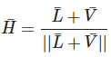
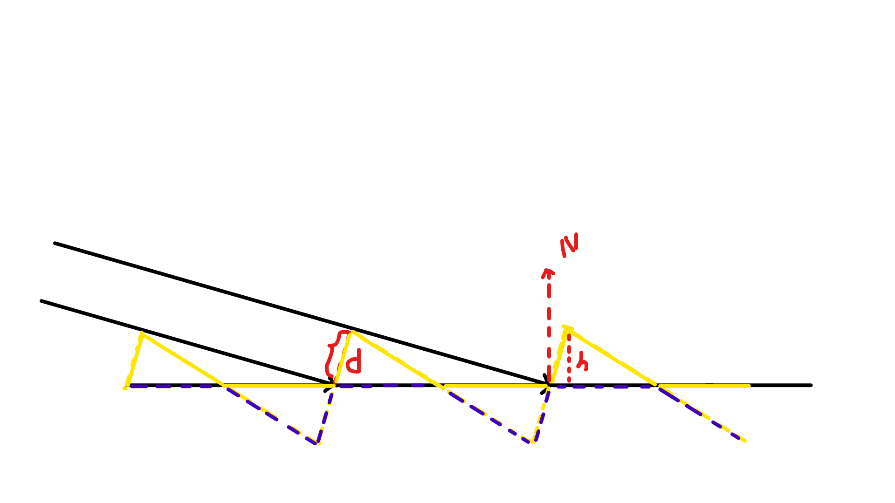
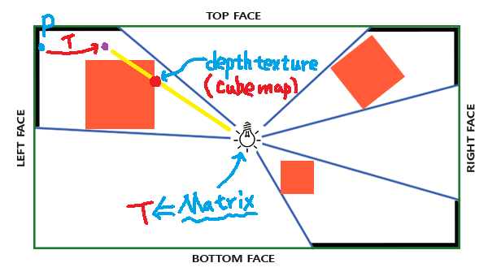
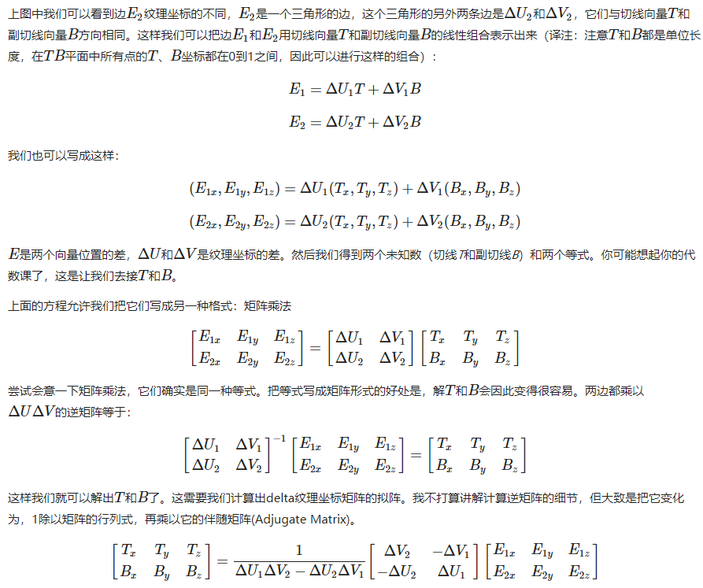
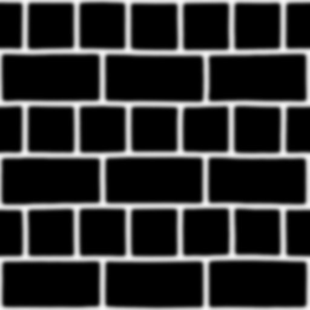
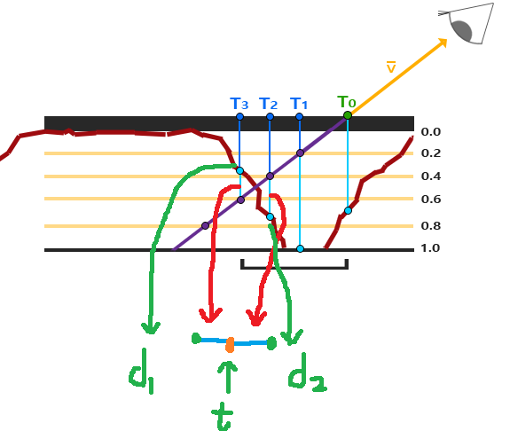
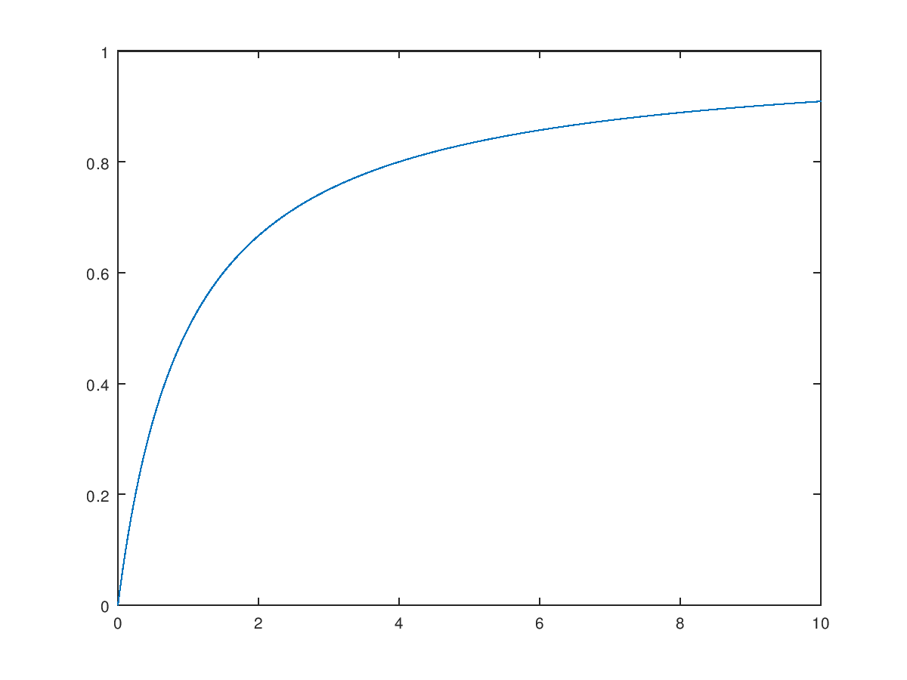
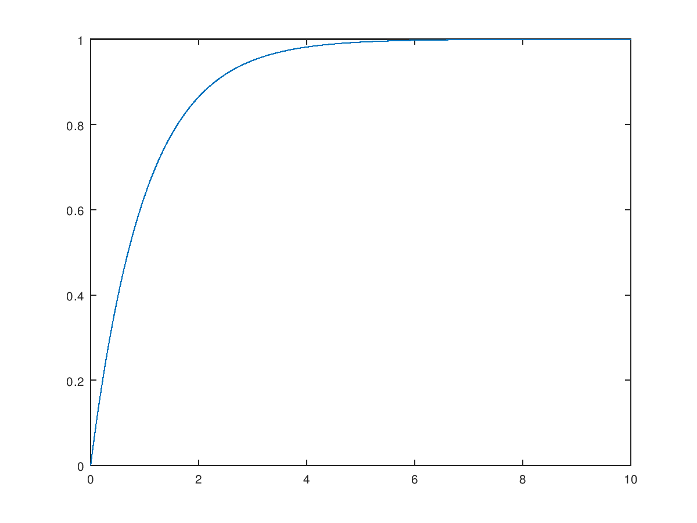

# 5. 高级光照

## 5.1 Blinn-Phong

冯氏光照不仅对真实光照有很好的近似，而且性能也很高。但是它的镜面反射会在一些情况下出现问题，特别是物体反光度很低时，会导致大片（粗糙的）高光区域。下面这张图展示了当反光度为1.0时地板会出现的效果：


原因是视线与反射光线的夹角超过90°


Blinn-Phong模型与冯氏模型非常相似，但是它对镜面光模型的处理上有一些不同，让我们能够解决之前提到的问题。Blinn-Phong模型不再依赖于反射向量，而是采用了所谓的半程向量(Halfway Vector)，即光线与视线夹角一半方向上的一个单位向量。当半程向量与法线向量越接近时，镜面光分量就越大。




效果如下


## 5.2 Gamma校正

过去，大多数监视器是阴极射线管显示器（CRT）。这些监视器有一个物理特性就是两倍的输入电压产生的不是两倍的亮度。输入电压产生约为输入电压的2.2次幂的亮度，这叫做监视器Gamma。

Gamma也叫灰度系数，每种显示设备都有自己的Gamma值，都不相同，有一个公式：设备输出亮度 = 电压的Gamma次幂，任何设备Gamma基本上都不会等于1，等于1是一种理想的线性状态，这种理想状态是：如果电压和亮度都是在0到1的区间，那么多少电压就等于多少亮度。对于CRT，Gamma通常为2.2，因而，输出亮度 = 输入电压的2.2次幂。

人类所感知的亮度恰好和CRT所显示出来相似的指数关系非常匹配。


```c
void main()
{
    // do super fancy lighting 
    [...]
    // apply gamma correction
    float gamma = 2.2;
    fragColor.rgb = pow(fragColor.rgb, vec3(1.0/gamma));
}
```

若要进行Gamma校正，需定义纹理为**sRGB纹理**，否则相当于进行了两次Gamma校正


光的衰减也只需使用线性的，Gamma校正会将其变成二次。


## 5.3 阴影映射


### 5.3.1 原理


### 5.3.2 阴影失真


深度增加bias，这样黄线就会都处于平面之下。

bias的大小根据光线与平面法线的夹角而定，夹角越大，bias越大。



### 5.3.3 视锥外采样


对于横向超出，使用`GL_CLAMP_TO_BORDER`来使z为1.0，即默认不处在阴影中

对于纵向超出(z>1.0)，默认不处在阴影中

```c
float ShadowCalculation(vec4 fragPosLightSpace)
{
    [...]
    if(projCoords.z > 1.0)
        shadow = 0.0;

    return shadow;
}
```


### 5.3.4 PCF

percentage-closer filtering

```c
float shadow = 0.0;
vec2 texelSize = 1.0 / textureSize(shadowMap, 0);
for(int x = -1; x <= 1; ++x)
{
    for(int y = -1; y <= 1; ++y)
    {
        float pcfDepth = texture(shadowMap, projCoords.xy + vec2(x, y) * texelSize).r; 
        shadow += currentDepth - bias > pcfDepth ? 1.0 : 0.0;        
    }    
}
shadow /= 9.0;
```


## 5.4 点阴影

### 5.4.1 原理



### 5.4.2 渲染技巧

- depthmap的纹理选择cubemap
- 集合着色器根据6个矩阵来变换顶点（通过内建变量face选择），输出到6个不同图层

### 5.4.3 PCF

```c
float shadow = 0.0;
float bias = 0.05; 
float samples = 4.0;
float offset = 0.1;
for(float x = -offset; x < offset; x += offset / (samples * 0.5))
{
    for(float y = -offset; y < offset; y += offset / (samples * 0.5))
    {
        for(float z = -offset; z < offset; z += offset / (samples * 0.5))
        {
            float closestDepth = texture(depthMap, fragToLight + vec3(x, y, z)).r; 
            closestDepth *= far_plane;   // Undo mapping [0;1]
            if(currentDepth - bias > closestDepth)
                shadow += 1.0;
        }
    }
}
shadow /= (samples * samples * samples);
```

总共27个样本，剔除彼此接近的方向，剩余20个

```c
vec3 sampleOffsetDirections[20] = vec3[]
(
   vec3( 1,  1,  1), vec3( 1, -1,  1), vec3(-1, -1,  1), vec3(-1,  1,  1), 
   vec3( 1,  1, -1), vec3( 1, -1, -1), vec3(-1, -1, -1), vec3(-1,  1, -1),
   vec3( 1,  1,  0), vec3( 1, -1,  0), vec3(-1, -1,  0), vec3(-1,  1,  0),
   vec3( 1,  0,  1), vec3(-1,  0,  1), vec3( 1,  0, -1), vec3(-1,  0, -1),
   vec3( 0,  1,  1), vec3( 0, -1,  1), vec3( 0, -1, -1), vec3( 0,  1, -1)
);
```

## 5.5 法线贴图

一般的方法都是逐顶点法向，然后每个fragment的法向由三角形插值得到。这样每个三角面片内部的法向变化是比较平滑的。考虑贴图的思路，可以将整个纹理的法向保存在贴图中，这样每个三角面片内部的法向是根据贴图获取来的，这样更加丰富了细节。


每个fragment使用了自己的法线，我们就可以让光照相信一个表面由很多微小的（垂直于法线向量的）平面所组成，物体表面的细节将会得到极大提升。这种每个fragment使用各自的法线，替代一个面上所有fragment使用同一个法线的技术叫做法线贴图（normal mapping）或凹凸贴图（bump mapping）。

应用到砖墙上，效果像这样：


### 5.5.1 贴图

可以将法线向量的x、y、z元素储存到纹理中，代替颜色的r、g、b元素。法线向量的范围在-1到1之间，所以我们先要将其映射到0到1的范围：

```c
vec3 rgb_normal = normal * 0.5 + 0.5; // 从 [-1,1] 转换至 [0,1]
```

将法线向量变换为像这样的RGB颜色元素，我们就能把根据表面的形状的fragment的法线保存在2D纹理中。教程开头展示的那个砖块的例子的法线贴图如下所示：


这会是一种偏蓝色调的纹理（你在网上找到的几乎所有法线贴图都是这样的）。这是因为所有法线的指向都偏向z轴（0, 0, 1）这是一种偏蓝的颜色。法线向量从z轴方向也向其他方向轻微偏移，颜色也就发生了轻微变化，这样看起来便有了一种深度。

> 绿色即表示y较大，朝上
>
> 红色即表示y较小，朝下
>
> 蓝色即表示z较大，朝外

### 5.5.2 方向问题

法线贴图的朝向是固定的，而实际fragment的法向并不是朝向正z方向，因此法向方向不正确，需要进行变换。


### 5.5.3 切线空间

切线空间是位于三角形表面上的空间

- N为法线
- T为切向，指向纹理的x轴
- B为副切向，指向纹理的y轴


只要求出N、T、B就能构造变换矩阵，将法线贴图的法向向量转换到切线空间中




### 5.5.4 实现思路

先求出各顶点的T向量，B向量可以用叉乘来获得，为保证N和T垂直，可以使用Gram-Schmidt process

```c
vec3 T = normalize(vec3(model * vec4(tangent, 0.0)));
vec3 N = normalize(vec3(model * vec4(normal, 0.0)));
// re-orthogonalize T with respect to N
T = normalize(T - dot(T, N) * N);
// then retrieve perpendicular vector B with the cross product of T and N
vec3 B = cross(T, N);

mat3 TBN = mat3(T, B, N)
```

由此可以用来变换法线贴图的法向向量

```c
normal = texture(normalMap, fs_in.TexCoords).rgb;
normal = normalize(normal * 2.0 - 1.0);   
normal = normalize(fs_in.TBN * normal);
```

### 5.6 视差贴图

视差贴图属于位移贴图(Displacement Mapping)技术的一种，它对根据储存在纹理中的几何信息对顶点进行位移或偏移。一种实现的方式是比如有1000个顶点，根据纹理中的数据对平面特定区域的顶点的高度进行位移。这样的每个纹理像素包含了高度值纹理叫做高度贴图。

一张简单的砖块表面的高度贴图如下所示：


整个平面上的每个顶点都根据从高度贴图采样出来的高度值进行位移，根据材质的几何属性平坦的平面变换成凹凸不平的表面。例如一个平坦的平面利用上面的高度贴图进行置换能得到以下结果：


置换顶点有一个问题就是平面必须由很多顶点组成才能获得具有真实感的效果，否则看起来效果并不会很好。

位移贴图技术不需要额外的顶点数据来表达深度，它像法线贴图一样采用一种聪明的手段欺骗用户的眼睛。

### 5.6.1 原理

这里粗糙的红线代表高度贴图中的数值的立体表达，向量 V 代表观察方向。如果平面进行实际位移，观察者会在点 B 看到表面。然而我们的平面没有实际上进行位移，观察方向将在点 A 与平面接触。视差贴图的目的是，**在 A位置上的fragment不再使用点 A 的纹理坐标而是使用点 B 的**。随后我们用点 B的纹理坐标采样，观察者就像看到了点 B 一样。


这个技巧在大多数时候都没问题，但点 B 是粗略估算得到的。当表面的高度变化很快的时候，看起来就不会真实，因为向量 P 最终不会和 B 接近，就像下图这样：


将 fragment 到观察者的向量 V 转换到切线空间中，经变换的 P 向量的 x 和 y 元素将于表面的切线和副切线向量对齐。由于切线和副切线向量与表面纹理坐标的方向相同，我们可以用 P 的 x 和 y 元素作为纹理坐标的偏移量，这样就不用考虑表面的方向了。

### 5.6.2 实现

使用反色高度贴图（也叫深度贴图）去模拟深度比模拟高度更容易。




```c
vec2 ParallaxMapping(vec2 texCoords, vec3 viewDir)
{ 
    float height =  texture(depthMap, texCoords).r;    
    vec2 p = viewDir.xy / viewDir.z * (height * height_scale);
    return texCoords - p;    
}
/*
有一个地方需要注意，就是viewDir.xy除以viewDir.z那里。因为viewDir向量是经过了标准化的，viewDir.z会在0.0到1.0之间的某处。当viewDir大致平行于表面时，它的z元素接近于0.0，除法会返回比viewDir垂直于表面的时候更大的P¯向量。所以基本上我们增加了P¯的大小，当以一个角度朝向一个表面相比朝向顶部时它对纹理坐标会进行更大程度的缩放；这会在角上获得更大的真实度。
*/
```


在视差贴图的那个平面里你仍然能看到在边上有古怪的失真。原因是在平面的边缘上，纹理坐标超出了0到1的范围进行采样，根据纹理的环绕方式导致了不真实的结果。解决的方法是当它超出默认纹理坐标范围进行采样的时候就丢弃这个fragment：

```c
texCoords = ParallaxMapping(fs_in.TexCoords,  viewDir);
if(texCoords.x > 1.0 || texCoords.y > 1.0 || texCoords.x < 0.0 || texCoords.y < 0.0)
    discard;
```

### 5.6.3 陡峭视差映射

陡峭视差映射(Steep Parallax Mapping)是视差映射的扩展，原则是一样的，但不是使用一个样本而是多个样本来确定向量P¯到B。它能得到更好的结果，它将总深度范围分布到同一个深度/高度的多个层中。从每个层中我们沿着P¯方向移动采样纹理坐标，直到我们找到了一个采样得到的低于当前层的深度值的深度值。看看下面的图片：


我们从上到下遍历深度层，我们把每个深度层和储存在深度贴图中的它的深度值进行对比。如果这个层的深度值小于深度贴图的值，就意味着这一层的P¯向量部分在表面之下。我们继续这个处理过程直到有一层的深度高于储存在深度贴图中的值：这个点就在（经过位移的）表面下方。

这里必须的**View必须是z等于1**的。

### 5.6.4 视差遮蔽映射

视差遮蔽映射(Parallax Occlusion Mapping)和陡峭视差映射的原则相同，但不是用触碰的第一个深度层的纹理坐标，而是在触碰之前和之后，在深度层之间进行线性插值。我们根据表面的高度距离啷个深度层的深度层值的距离来确定线性插值的大小。



## 5.7 HDR

显示器被限制为只能显示值为0.0到1.0间的颜色，但是在光照方程中却没有这个限制。通过使片段的颜色超过1.0，我们有了一个更大的颜色范围，这也被称作**HDR(High Dynamic Range, 高动态范围)**。有了HDR，亮的东西可以变得非常亮，暗的东西可以变得非常暗，而且充满细节。

HDR渲染允许用更大范围的颜色值渲染从而获取大范围的黑暗与明亮的场景细节，最后将所有HDR值转换成在[0.0, 1.0]范围的LDR(Low Dynamic Range,低动态范围)。转换HDR值到LDR值得过程叫做色调映射(Tone Mapping)，现在现存有很多的色调映射算法，这些算法致力于在转换过程中保留尽可能多的HDR细节。这些色调映射算法经常会包含一个选择性倾向黑暗或者明亮区域的参数。

重点就在这个映射上。

### 5.7.1 色调映射

**Reinhard色调映射**

```c
vec3 mapped = hdrColor / (hdrColor + vec3(1.0));
```



可以看到[0-1]只占了[0-0.5]的范围，更亮的颜色占了另一半。可以通过调节公式里的`1.0`来改变倾向。

**Exposure色调映射**

```c
vec3 mapped = vec3(1.0) - exp(-hdrColor * exposure);
```

当`exposure=1.0`时图像如下



可以看到[0-1]占了[0-0.63]，通过调节`exposure`可以调节低光[0-1]所占部分，所对应图像同上（x为exposure，y为颜色1的值）

### 5.7.2 实现细节

- 浮点帧缓冲
- 后期处理